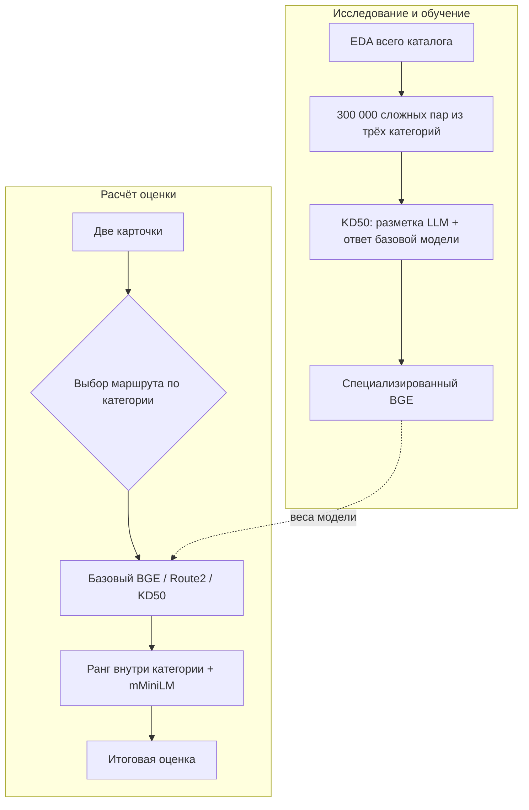

# Ambiguous Route2

### Матчинг, который учитывает различия между товарными категориями

Задача звучит просто: по двум карточкам определить, описывают ли они один и тот же товар. Но одинаковые слова в разных частях каталога имеют разный вес. Если названия музыкальных инструментов совпадают, перед нами один товар в 95.69% случаев. Для аксессуаров тот же признак даёт лишь 6.01% совпадений.

Этот разрыв определил всё решение. Вместо одной модели для двадцати категорий Ambiguous Route2 использует три маршрута: базовый BGE для пятнадцати категорий, адаптированный BGE для мебели и обуви, отдельный KD50 для аксессуаров, одежды и ювелирных изделий.

За этим выбором стоит анализ 13 397 761 карточки, 365 654 пар с ручной разметкой и 11 187 780 пар с мягкой LLM-разметкой. Мы проверили тексты, схемы атрибутов, числовые противоречия, связность графа совпадений и различия между категориями.

> Официальный результат E-CUP 2026: macro PR-AUC `0.5259256928`, статус `Success`. Контрольный запуск в конкурсном контейнере: 20 000 пар за 43.3 секунды, без доступа к сети.



## Что показал EDA

Точное совпадение текста оказалось сильным, но ненадёжным признаком. В каталоге есть 1 806 552 полностью одинаковые карточки. При этом крупнейшая группа насчитывает 6 002 записи с общим названием вроде «палатка 2-местная». Без категории и характеристик такое совпадение почти ничего не говорит о конкретном товаре.

Граф ручной разметки слишком разрежен, чтобы строить на нём основную модель: 97.72% вершин имеют только одну связь, треугольников нет. Значит, перенос меток по соседям не даёт достаточного покрытия.

Числа тоже нельзя использовать как жёсткое правило. Числовые различия встречаются в 32 452 положительных парах ручной разметки и более чем в миллионе пар, которые LLM считает совпадениями. Одно и то же число может обозначать размер, год, количество, OEM-код или часть названия модели.

Наконец, мягкие LLM-метки лежат на дискретной сетке `k/9`, а их распределение заметно меняется между категориями. Поэтому мы используем их как обучающий сигнал, но не считаем готовой вероятностью совпадения.

Из этих наблюдений следуют три решения:

1. Карточка подаётся в модель одной строкой: категория, название и характеристики. Строка ограничена 3 600 символами, после токенизации остаётся до 384 токенов.
2. Обучающие пары собираются отдельно для сложных категорий. В выборку обязательно входят промежуточные LLM-оценки, конфликты при одинаковом названии, пары с высокой оценкой и разными формулировками, ловушки с общим началом названия и случайный остаток.
3. Каждая из трёх категорий получает по 100 000 пар, чтобы объём исходных данных не определял результат обучения.

## От данных к гипотезе

После EDA ключевым стал вопрос: как доучить модель на сложных категориях и не потерять уже выученное поведение?

В статье [jina-reranker-v3.5](https://arxiv.org/html/2607.18152v1) обучение начинается с разбора конкретных ошибок общей модели. Затем под найденные ошибки собираются отдельные данные. Мы взяли именно этот принцип: сначала выделили проблемные категории и типы пар, потом построили под них обучающую выборку. Архитектуру Jina и её веса решение не использует.

[Learning without Forgetting](https://arxiv.org/abs/1606.09282) предлагает сохранять ответы старой модели во время обучения на новых данных. [Born-Again Neural Networks](https://proceedings.mlr.press/v80/furlanello18a.html) показывает, что дистилляция работает и между моделями одинаковой архитектуры. Поэтому новый KD50 получает половину целевой оценки от LLM, а половину от замороженного базового BGE.

[RankNet](https://www.microsoft.com/en-us/research/publication/learning-to-rank-using-gradient-descent/) дал вторую часть функции потерь: модель штрафуется, если пара с более высокой целевой оценкой получает меньший логит. [DiVE](https://openaccess.thecvf.com/content/ICCV2021/html/He_Distilling_Virtual_Examples_for_Long-Tailed_Recognition_ICCV_2021_paper.html) помог рассматривать мягкие ответы модели-учителя как распределение обучающего сигнала, а не как обычные бинарные метки.

Так появилась KD50-гипотеза: новая модель учится на сложных парах, но её оценки удерживаются рядом с уже обученным BGE.

## Как работает KD50

Базовый BGE получает две карточки и выдаёт логит совпадения. Для каждой обучающей пары мы считаем оба порядка: `(a, b)` и `(b, a)`. После сигмоиды две оценки усредняются.

$$
y_{KD50}=0.5\,y_{LLM}+0.5\,\frac{\sigma(z_{base}(a,b))+\sigma(z_{base}(b,a))}{2}
$$

Первая половина добавляет обучающий сигнал из официальной LLM-разметки. Вторая ограничивает отклонение KD50 от базовой модели.

Модель-учитель и модель-ученик используют один и тот же BGE на 600 млн параметров. У ученика заморожены слой входных представлений и нижние 20 из 24 слоёв энкодера. BCE приближает оценки к KD50, а попарная функция потерь штрафует неправильный порядок примеров внутри одной категории. Обучение занимает 2 346 шага по выборке из 300 000 пар.

Остальные пятнадцать категорий от этого обучения не зависят: маршрутизатор всегда отправляет их в неизменённый базовый BGE.

## Как выбирались маршруты

Первую адаптированную версию BGE обучали сразу на шести категориях. Проверка по каждой категории показала, что перенос работает по-разному. Поэтому эту версию оставили только для мебели и обуви. Так появился Route2.

Для второго BGE мы заранее зафиксировали абляции по доле дистилляции, начальной точке обучения, числу замороженных слоёв, скорости обучения и весу попарной функции потерь. Общая модель для семи категорий не прошла проверку.

Финальная комбинация KD50 с инициализацией из Route2 проверялась на двух независимых наборах, не использованных при обучении. Во всех трёх целевых категориях результат изменился в положительную сторону на обоих наборах. После этого маршруты зафиксировали и собрали посылку. Полная сетка экспериментов находится в [`docs/EXPERIMENTS.md`](docs/EXPERIMENTS.md).

## Как строится итоговая оценка

| Компонент | Роль |
|---|---|
| Базовый BGE | Основной многоязычный cross-encoder на 600 млн параметров. Обрабатывает пятнадцать категорий |
| Route2 | Версия BGE, разрешённая только для мебели и обуви после покатегорийной проверки |
| KD50 | BGE для аксессуаров, одежды и ювелирных изделий, обученный на смеси LLM-разметки и ответов базового BGE |
| mMiniLM | Независимо ранжирует те же пары и добавляет вторую оценку |

Перед смешиванием оценки BGE и mMiniLM переводятся в процентили внутри категории. Это позволяет объединять модели с разными шкалами логитов. Итоговая оценка равна `0.725 × ранг BGE + 0.275 × ранг mMiniLM`.

`run.py` потоково читает `items.parquet` и сохраняет только карточки из входных пар. Пары сортируются по длине, чтобы сократить число пустых токенов в batch. Модели загружаются по очереди и освобождаются после обработки своего маршрута.

Обратный порядок пары считается только для верхней половины оценок внутри категории. BGE работает с `max_length=384` и размером batch 384, mMiniLM с `max_length=256` и размером batch 1024.

## Код и запуск

| Файл | Что внутри |
|---|---|
| [`run.py`](run.py) | чтение данных, маршрутизация, обратный порядок пар и смешивание оценок |
| [`targeted_route.py`](targeted_route.py) | распределение пар между моделями и восстановление исходного порядка |
| [`structured_features.py`](structured_features.py) | сериализация карточек |
| [`training/prepare_distillation.py`](training/prepare_distillation.py) | отбор пар, оценки базового BGE и построение KD50 |
| [`training/train_specialist.py`](training/train_specialist.py) | обучение KD50 |
| [`docs/EDA.md`](docs/EDA.md) | полный анализ данных |

Веса находятся в [архиве решения, прошедшего официальную оценку](https://storage.yandexcloud.net/ds-ods/files/submissions/0d0183cf-8864-4331-88be-f78da0c68dd2/c1a51c4b/submission-ambiguous-route2-v1.zip):

```bash
curl -L https://storage.yandexcloud.net/ds-ods/files/submissions/0d0183cf-8864-4331-88be-f78da0c68dd2/c1a51c4b/submission-ambiguous-route2-v1.zip -o /tmp/ambiguous-route2.zip
unzip /tmp/ambiguous-route2.zip 'models/*' -d .
python -u run.py \
  --items_path /data/items.parquet \
  --matches_path /data/matches.parquet \
  --output_path submission.csv
```

Подготовка данных, обучение и упаковка описаны в [`docs/REPRODUCIBILITY.md`](docs/REPRODUCIBILITY.md). Данные соревнования в репозиторий не входят.
