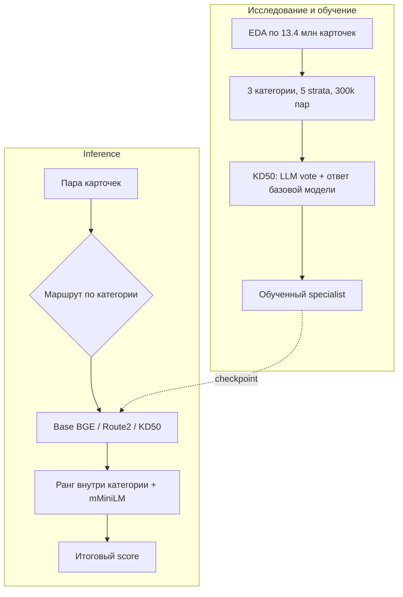

# Ambiguous Route2

### Category-aware self-distillation для product matching

Для каждой пары карточек нужно определить, описывают ли они один товар. В каталоге из 13,4 млн карточек одинаковое название означает разные вещи: среди таких пар доля совпадений меняется от 6.01% в аксессуарах до 95.69% в музыкальных инструментах. Анализ охватил 365 654 пар с ручной разметкой, 11 187 780 пар с LLM-разметкой, структуру атрибутов, числовые конфликты и граф совпадений.

Решение направляет категории в три маршрута. Базовая модель обслуживает 15 категорий. Её адаптированная версия включается для `Мебели` и `Обуви`. Отдельная модель отвечает за аксессуары, одежду и ювелирные изделия; она обучена на 300 000 отобранных пар по методу KD50.

> Официальная оценка E-CUP 2026: macro PR-AUC `0.5259256928`, статус `Success`. Exact-container smoke: 20 000 пар за 43.3 секунды, без сети во время inference.



## Что EDA изменил в методе

EDA охватил содержимое карточек, связи между парами и качество supervision.

| Проверка | Что нашли | Решение |
|---|---|---|
| Exact text | 1 806 552 полных текстовых дубля; крупнейшая группа содержит 6 002 карточки с общим названием | Не использовать exact title как shortcut; читать category и attributes |
| Human graph | 97.72% вершин имеют degree 1, triangles отсутствуют | Не строить основной сигнал на graph propagation |
| Numeric conflicts | 32 452 positive human-пары и 1 020 483 majority-positive LLM-пары содержат конфликтующие числа | Не вводить универсальный numeric veto |
| LLM votes | Targets лежат на сетке `k/9`, prevalence зависит от категории | Не считать vote калиброванной вероятностью; использовать его как soft signal |
| Attribute schemas | Карточки одной пары часто приходят из разных marketplace schemas | Сериализовать поля в один текст вместо позиционного сравнения ключей |

Для обучения specialist данные собираются по пяти strata: промежуточные LLM votes, exact-name conflicts, high-vote lexical mismatches, shared-prefix traps и остаточная выборка. Каждый тип ошибки гарантированно попадает в training corpus. Три категории получают по 100 000 строк, поэтому размер домена не определяет смесь данных.

Модель получает единую строку `Category + Name + Attributes`. Сериализация ограничена 3 600 символами, primary tokenizer оставляет до 384 tokens.

## Как статьи превратились в гипотезу

[jina-reranker-v3.5](https://arxiv.org/html/2607.18152v1) дал исследовательский шаблон: сначала найти конкретные failure modes general reranker, затем собрать targeted corpus под эти ошибки. В статье этот принцип применяется к legal, medical, financial и structured retrieval. Здесь он привёл к category-specific strata и отдельному specialist для трёх неоднозначных товарных доменов. Архитектуру Jina и её weights решение не использует.

Вторая идея связана с сохранением уже выученной функции. [Learning without Forgetting](https://arxiv.org/abs/1606.09282) использует ответы старой модели как часть supervision при обучении на новых данных. [Born-Again Neural Networks](https://proceedings.mlr.press/v80/furlanello18a.html) показывает, что teacher и student могут иметь одинаковую ёмкость: distillation здесь передаёт поведение, а не сжимает модель. Поэтому KD50 student сохраняет 0.6B BGE architecture и учится одновременно у официального LLM signal и frozen Base BGE.

[RankNet](https://www.microsoft.com/en-us/research/publication/learning-to-rank-using-gradient-descent/) добавил pairwise часть objective. Она штрафует инверсии между примерами одной категории, если разница их KD targets не меньше `0.2`. [DiVE](https://openaccess.thecvf.com/content/ICCV2021/html/He_Distilling_Virtual_Examples_for_Long-Tailed_Recognition_ICCV_2021_paper.html) помог интерпретировать soft teacher outputs как распределение supervision, а не как обычные hard labels. Равные category quotas при этом следуют из нашего EDA, не из DiVE.

Эти работы привели к проверяемой гипотезе: specialist получает новый signal на выбранных failure slices, а frozen scorer в KD target регулирует его отклонение от базовой модели.

## KD50: что именно обучается

Базовая модель, Base BGE, совместно читает две карточки и выдаёт logit совпадения. Для каждой training pair она вызывается в обоих направлениях: `(a, b)` и `(b, a)`. После sigmoid ответы усредняются.

$$
y_{KD50}=0.5\,y_{LLM}+0.5\,\frac{\sigma(z_{base}(a,b))+\sigma(z_{base}(b,a))}{2}
$$

`y_LLM` добавляет официальный soft-label signal на выбранных failure slices. Вторая половина target регуляризует specialist в сторону Base BGE. Поведение остальных 15 категорий сохраняет router: specialist там вообще не участвует в forward path.

Student и teacher имеют одинаковую BGE architecture. У student заморожены embeddings и нижние 20 из 24 encoder layers. Soft BCE учит score по KD50 target. Pairwise term требует, чтобы пример с большим target получал больший logit; сравниваются только примеры одной категории. Один training run занимает 2 346 optimizer updates по сбалансированному корпусу из 300 000 строк.

## Как выбиралась финальная конфигурация

Первый adapted checkpoint обучался на six-category corpus. Покатегорийная проверка показала transfer разного знака, поэтому global deployment был отвергнут. В inference этот checkpoint разрешён только для `Мебели` и `Обуви`; отсюда Route2.

Для specialist заранее зафиксировали ablations по доле distillation, initialization, глубине заморозки, learning rate и pairwise weight. Общий seven-category specialist не прошёл transfer gate; подробная сетка находится в [`docs/EXPERIMENTS.md`](docs/EXPERIMENTS.md).

Финальный блок из аксессуаров, одежды и ювелирных изделий проверялся на двух независимых source-closed панелях. KD50 с Route2 initialization дал положительное изменение во всех трёх категориях на обеих панелях. Маршруты зафиксировали по результатам этих проверок до упаковки submission.

## Что происходит на inference

| Компонент | Роль |
|---|---|
| Base BGE | Основной 0.6B multilingual cross-encoder; совместно читает две карточки и обслуживает 15 категорий |
| Route2 BGE | Checkpoint с six-category training lineage, включённый только для `Мебели` и `Обуви` после покатегорийной проверки |
| KD50 specialist | Route2-initialized BGE для аксессуаров, одежды и ювелирных изделий; официальный LLM signal учит пограничным случаям, Base BGE регулирует отклонение |
| mMiniLM | Независимо ранжирует те же пары и даёт второй score |

Перед смешиванием BGE и mMiniLM scores переводятся в процентиль внутри категории. Так несовместимые шкалы logits не усредняются напрямую. Итоговый score равен `0.725 × BGE rank + 0.275 × mMiniLM rank`.

## Почему решение укладывается в runtime

`run.py` потоково сканирует `items.parquet` и сохраняет только карточки из входных пар. Пары сортируются по суммарной длине, чтобы сократить объём padding. BGE-модели загружаются последовательно и освобождаются после своего маршрута.

Обратный порядок пары считается только для верхней половины распределения scores внутри категории. Дополнительный проход сосредоточен на парах, влияющих на верхнюю часть ranking. BGE-модели работают с `max_length=384` и batch size 384; mMiniLM использует `max_length=256` и batch size 1024.

## Код и запуск

| Файл | Ответственность |
|---|---|
| [`run.py`](run.py) | streaming I/O, routing, reverse scoring, rank blend |
| [`targeted_route.py`](targeted_route.py) | category masks и восстановление порядка пар |
| [`structured_features.py`](structured_features.py) | сериализация карточек |
| [`training/prepare_distillation.py`](training/prepare_distillation.py) | failure-targeted sampling, Base BGE scoring, KD50 |
| [`training/train_specialist.py`](training/train_specialist.py) | frozen-depth training, soft BCE, pairwise loss |
| [`docs/EDA.md`](docs/EDA.md) | полный EDA и связь измерений с дизайном |

Веса находятся в [архиве решения, прошедшего официальную оценку](https://storage.yandexcloud.net/ds-ods/files/submissions/0d0183cf-8864-4331-88be-f78da0c68dd2/c1a51c4b/submission-ambiguous-route2-v1.zip):

```bash
curl -L https://storage.yandexcloud.net/ds-ods/files/submissions/0d0183cf-8864-4331-88be-f78da0c68dd2/c1a51c4b/submission-ambiguous-route2-v1.zip -o /tmp/ambiguous-route2.zip
unzip /tmp/ambiguous-route2.zip 'models/*' -d .
python -u run.py \
  --items_path /data/items.parquet \
  --matches_path /data/matches.parquet \
  --output_path submission.csv
```

Подготовка данных, обучение и упаковка описаны в [`docs/REPRODUCIBILITY.md`](docs/REPRODUCIBILITY.md). Данные соревнования в репозиторий не входят.
