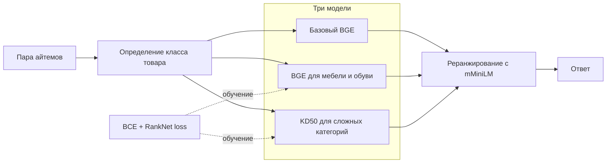

# Описание решения 

### Основная идея - маршрутизация по категориям

Задача состоит в том, чтобы определить, описывают ли два айтема один товар. Самый очевидный сигнал, совпадение названий, ведёт себя совершенно по-разному в разных категориях. У музыкальных инструментов одинаковые названия почти всегда указывают на один товар. У аксессуаров это происходит примерно в шести случаях из ста.

Поэтому категория здесь не просто ещё один признак. Она выбирает одну из трёх моделей. Базовый BGE работает с пятнадцатью категориями, где его поведение оказалось устойчивым. Второй BGE обучен на шести категориях, но используется только для мебели и обуви. Третий отвечает за одежду, аксессуары и ювелирные изделия, где похожий текст чаще всего скрывает важные различия.

Но сама маршрутизация не главная часть метода. Для третьей модели мы строим новый target, который соединяет разметку пары с ответом базового BGE. Затем учим модель сразу двум вещам: воспроизводить эту мягкую оценку и правильно расставлять пары по степени похожести внутри одной категории. Первый loss отвечает за значение оценки, второй за порядок. Такая связка позволяет исправлять трудные случаи и одновременно удерживает модель рядом с уже устойчивым решением.



## Что мы увидели в данных

**Одинаковое название может означать и конкретный товар, и целый класс товаров.** В данных около 1,8 миллиона повторяющихся описаний. В одних категориях точное совпадение названия почти однозначно. В других одно общее название используют тысячи разных айтемов, которые отличаются моделью, материалом или характеристиками. Значит, совпадение текста нельзя интерпретировать без категории.

**Разные числа не всегда означают разные товары.** Число в описании может быть размером, количеством в комплекте, годом выпуска, частью артикула или названием модели. Иногда различие критично, иногда оно относится только к варианту товара. Жёсткая проверка чисел одновременно пропускала бы неверные пары и отбрасывала верные.

**Основные ошибки сосредоточены в нескольких категориях.** Для одежды, аксессуаров и ювелирных изделий особенно часто встречаются почти одинаковые названия, неполные характеристики и разные способы описать один товар. На простых примерах базовый BGE уже отвечает уверенно, поэтому повторно учить его на случайной выборке малоинтересно.

Мы собираем выборку вокруг конкретных ошибок: одинаковые названия при разных характеристиках, разные формулировки одного товара, уверенно похожие пары без совпадения названий и сложные отрицательные примеры с общим началом текста. Каждая из трёх категорий получает по 100 000 пар.

## Рефернсы статей, которые легли в решение

В [jina-reranker-v3.5](https://arxiv.org/html/2607.18152v1) авторы начинают с разбора ошибок общей модели, а затем собирают данные именно под найденные типы ошибок. Мы использовали тот же принцип: сначала нашли слабые места базового BGE, затем превратили их в правила отбора обучающих пар. Архитектуру и веса Jina решение не использует.

[Learning without Forgetting](https://arxiv.org/abs/1606.09282) предлагает сохранять поведение исходной модели во время обучения на новых данных. [Born-Again Neural Networks](https://proceedings.mlr.press/v80/furlanello18a.html) показывает, что модель может учиться у другой версии той же архитектуры. Отсюда появилась идея не заменять исходную разметку ответом базового BGE, а смешать оба сигнала поровну.

[RankNet](https://www.microsoft.com/en-us/research/publication/learning-to-rank-using-gradient-descent/) дал вторую часть функции потерь. В матчинге недостаточно приблизить каждую оценку отдельно. Нужно, чтобы более вероятное совпадение получило больший логит. Поэтому обучение сравнивает пары между собой и штрафует неправильный порядок.

[DiVE](https://openaccess.thecvf.com/content/ICCV2021/html/He_Distilling_Virtual_Examples_for_Long-Tailed_Recognition_ICCV_2021_paper.html) помог сохранить промежуточные значения target. Пограничный пример не превращается в грубый ноль или единицу. Модель видит степень уверенности, что особенно важно для неполных и неоднозначных описаний.

Так из четырёх работ получилась одна гипотеза: обучающие пары нужно выбирать по ошибкам, target нужно стабилизировать ответом исходной модели, а loss должен учитывать и значение оценки, и порядок пар.

## Симметричный KD50 target

Cross-encoder чувствителен к порядку входов, хотя товарный матчинг должен быть симметричным. Поэтому базовый BGE оценивает каждую пару в обоих направлениях. Его две вероятности усредняются:

$$
p_{base}(a,b)=\frac{\sigma(z_{base}(a,b))+\sigma(z_{base}(b,a))}{2}
$$

После этого строится KD50 target:

$$
t(a,b)=0.5\,y(a,b)+0.5\,p_{base}(a,b)
$$

Здесь $y(a,b)$ обозначает исходную мягкую разметку. Первая половина target несёт новый сигнал из данных. Вторая не даёт новой модели далеко уйти от базового BGE. Название KD50 как раз указывает на это равное смешивание.

Во время обучения каждая пара также подаётся в двух порядках. Это не просто аугментация: модель получает один target для обоих направлений и учится не менять решение от перестановки айтемов.

## Два loss вместо одного

Итоговая функция потерь состоит из поточечной и попарной частей:

$$
\mathcal{L}=\mathcal{L}_{BCE}+0.5\,\mathcal{L}_{rank}
$$

BCE учит модель воспроизводить KD50 target для каждой пары. Но близкая средняя ошибка ещё не гарантирует хорошее ранжирование. Модель может дать двум примерам почти правильные оценки и при этом поставить худший пример выше лучшего.

Попарный loss исправляет именно это:

$$
P=\{(i,j)\mid t_i-t_j\geq0.2\}, \qquad
\mathcal{L}_{rank}=\frac{1}{|P|}\sum_{(i,j)\in P}\log\left(1+e^{-(z_i-z_j)}\right)
$$

Для каждого batch выбираются пары примеров, у которых целевые оценки различаются достаточно заметно. Если пример $i$ должен стоять выше примера $j$, но его логит меньше, штраф растёт. Почти равные оценки не сравниваются, потому что их порядок ненадёжен и создаёт лишний шум.

В каждый batch входят примеры одной категории. Поэтому RankNet не сравнивает, например, уверенность модели на обуви и украшениях, где распределения оценок различаются. Он учит локальный порядок только там, где такое сравнение имеет смысл.

## Как модель сохраняет старые знания

Модель для одежды, аксессуаров и ювелирных изделий инициализируется из уже обученного BGE. Слой входных представлений и нижние 20 из 24 слоёв энкодера заморожены. Меняются только верхние слои и классификационная голова.

Такое ограничение решает сразу две задачи. Нижняя часть сети сохраняет общее многоязычное представление товарных описаний. Верхняя часть получает достаточно свободы, чтобы выучить различия между близкими айтемами в трёх сложных категориях. Низкий learning rate и один проход по выборке дополнительно уменьшают дрейф модели.

Первую дополнительную модель BGE обучали сразу на шести категориях. Покатегорийная проверка показала, что она действительно полезна только для мебели и обуви. Для второй модели мы сравнили разные доли ответа базового BGE, исходные веса, число замороженных слоёв и вес RankNet loss. Общая модель для семи категорий проверку не прошла, а версия для трёх сложных категорий дала согласованное улучшение на двух независимых наборах.

## Как считается итоговая оценка

После выбора одной из трёх моделей BGE пара получает логит совпадения. Затем логиты переводятся в ранги внутри категории. Это убирает несовместимость шкал: один и тот же логит может означать разную степень уверенности для обуви и аксессуаров.

mMiniLM независимо ранжирует те же пары. Его ранг добавляется к рангу выбранной модели BGE как второй взгляд на текст. На выходе получается оценка для сортировки пар, а не вероятность совпадения.

[`run.py`](run.py) читает данные частями и держит в памяти только нужные айтемы. Пары группируются по длине описаний, а три модели BGE загружаются по очереди. Полный ансамбль помещается в конкурсный контейнер и работает без доступа к сети.

## Код и запуск

| Файл | Назначение |
|---|---|
| [`run.py`](run.py) | чтение данных, выбор модели и объединение рангов |
| [`targeted_route.py`](targeted_route.py) | распределение пар между тремя BGE |
| [`structured_features.py`](structured_features.py) | сборка текстового описания айтема |
| [`training/prepare_distillation.py`](training/prepare_distillation.py) | отбор пар, симметричная оценка базового BGE и построение KD50 target |
| [`training/train_specialist.py`](training/train_specialist.py) | BCE, RankNet loss, батчи из одной категории и обучение верхних слоёв |

Веса находятся в [архиве решения](https://storage.yandexcloud.net/ds-ods/files/submissions/0d0183cf-8864-4331-88be-f78da0c68dd2/c1a51c4b/submission-ambiguous-route2-v1.zip):

```bash
curl -L https://storage.yandexcloud.net/ds-ods/files/submissions/0d0183cf-8864-4331-88be-f78da0c68dd2/c1a51c4b/submission-ambiguous-route2-v1.zip -o /tmp/ambiguous-route2.zip
unzip /tmp/ambiguous-route2.zip 'models/*' -d .
python -u run.py \
  --items_path /data/items.parquet \
  --matches_path /data/matches.parquet \
  --output_path submission.csv
```

Данные соревнования в репозиторий не входят.
